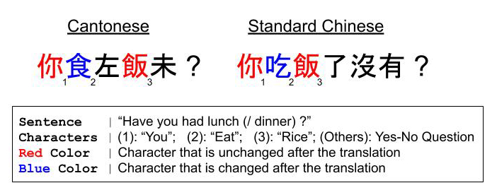
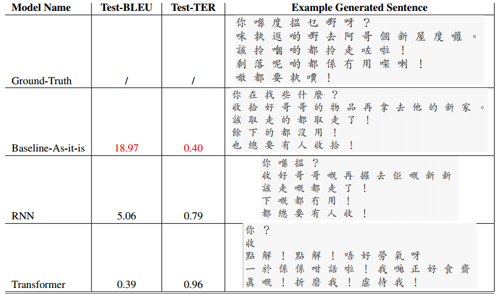

# Cantonese-Chinese-Translation

An experimental study on *Standard-Chinese* to *Cantonese* translator models.  

    

### <a href="/code/v2" target="_blank">V2 (2020-Mar)</a>

#### Abstract: *Learning Cantonese from Standard-Chinese with Neural Machine Translation*

> (As a continuation of the previous project) this project focuses on Neural Machine Translation (NMT) between Standard Chinese and Cantonese, with the former as the source language and the latter as the target language.

Preliminary translation result of two sequence-to-sequence models: a vanilla RNN model with Gated Recurrent Units and attention, and the Transformer model:

    

### <a href="/code/v1" target="_blank">V1 (2019-Dec)</a>

#### Abstract: *Dialect as a Low-Resource Language: A Study on Standard-Chinese to Cantonese Translation with Movie Transcripts*

> Cantonese, a major Chinese spoken dialect, can be viewed a a low-resource language given that its raw written form of collection is scarce. This project develops a pipeline to accomplish the low-resource Cantonese translation task with its closely-related rich-resource language counterparts, Standard Chinese (SC). The pipeline consists of two major translation methods: (1) the sequence-to-sequence neural-network approach suggested by Jhamtani et al. (2017), and (2) the translation-matrix approach suggested by Mikolov et al. (2013). Our implementation to perform machine translation from SC to Cantonese, in a simplified setting, do not have satisfying results nor perform better than the baselines. This report describes the similarities and difference between our implementation and the original approaches, and also discusses possible future improvement.

Two major approaches are included:

- Copy-Enriched Seq2Seq Models (Jhamtani., 2017)
- Enriched dictionary table by Translation-Matrix (Mikolov., 2013)

Check <a href="/code/v1" target="_blank">here</a> for more instructions. This version of code is initiated from the work by <a href="https://github.com/harsh19/Shakespearizing-Modern-English" target="_blank">  Jhamtani </a>.

